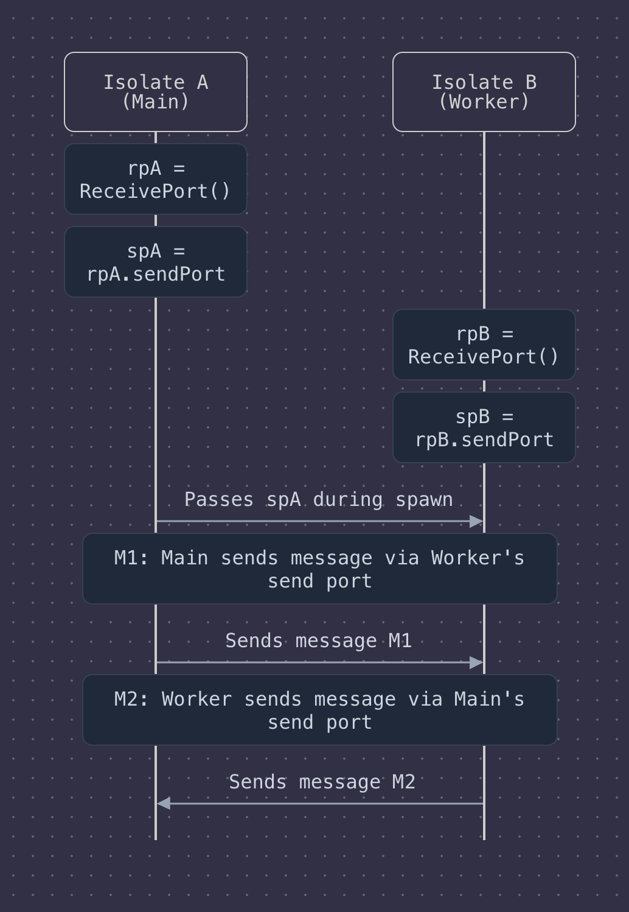

## Unlocking Performance: Concurrency and Parallelism in Dart (Beyond the Basics)

So, you've already probably heard about threads and how they help apps do multiple things at once, keeping everything smooth. In Dart, things are a bit unique. While we don't typically juggle traditional threads like in some other languages, Dart provides powerful mechanisms for both **concurrency** (making progress on multiple tasks without necessarily doing them at the exact same microsecond) and **parallelism** (actually doing multiple tasks simultaneously on different processor cores).

We've already touched upon *what* these concepts mean. Now, let's dive into the *why, how, and when* you’d leverage these in your pure Dart applications to build more responsive and performant software.

### Why Bother? The Need for Speed and Responsiveness

Imagine your Dart app needs to fetch data from a network, read a large file, or perform a really complex calculation. If you do this directly on the main isolate (the single thread of execution Dart applications start with), your entire application freezes. No user interface updates, no responses to clicks – just a frustrating pause. This is where Dart's asynchronous tools come in.

  * **Concurrency (`async`/`await`)** is fantastic for I/O-bound operations. Think network requests, file system access, or waiting for timers. Your app can start an operation, then go do something else while it waits for the operation to complete, preventing the UI from freezing. It's like a chef starting to boil water (an I/O task) and then chopping vegetables while the water heats up. They're making progress on multiple tasks, but not necessarily doing both at the exact same instant.
  * **Parallelism (Isolates)** is your go-to for CPU-bound operations. These are tasks that really crunch numbers and would hog the processor, like parsing massive JSON files, complex image processing, or cryptographic calculations. Isolates allow Dart to execute code on other processor cores, truly in parallel, without blocking your main application's responsiveness. This is like having multiple chefs in the kitchen, each working on a different complex dish simultaneously.

### How Dart Does It: The Event Loop and Isolates

Dart's main execution model is single-threaded within each isolate, revolving around an **event loop**. When you use `async` and `await` within an isolate, you're telling Dart, "Hey, this operation might take a while. Don't just sit there; go process other events, and come back to this `Future` when it completes." This is great for I/O tasks because the CPU isn't actually busy during the wait; it's just waiting for data to arrive from the network or disk.

But what if the CPU *is* the bottleneck? That's where **Isolates** shine.

An Isolate is like an independent worker with its own memory and its own event loop. **Crucially, isolates do not share memory with your main application's isolate (or any other isolate).** Each isolate has its own memory heap, ensuring that there are no race conditions on shared data and avoiding the need for complex locking mechanisms found in traditional multithreading. This is a fundamental aspect of Dart's concurrency model, designed for safety and simplicity.

#### Communication Between Isolates: Message Passing, `SendPort`, and `ReceivePort`

Since isolates don't share memory, communication between them happens exclusively by **passing messages**. Think of it like sending letters or packages back and forth between separate offices—it's safe, controlled, and asynchronous.

**How Message Passing Actually Works:**
When an isolate sends a message to another, the Dart runtime effectively copies the message (or transfers ownership of certain types of data) from the sender's memory heap to the receiver's memory heap. This ensures isolation is maintained. The receiving isolate then processes this message via its event loop.

This mechanism is facilitated by `SendPort` and `ReceivePort` objects:

  * `ReceivePort`: An isolate creates a `ReceivePort` to listen for incoming messages. It exposes a `Stream` that emits messages as they arrive. A `ReceivePort` has a corresponding `SendPort`.
  * `SendPort`: The `SendPort` is like the mailing address for its `ReceivePort`. You can pass a `SendPort` to another isolate, allowing that isolate to send messages back to the `ReceivePort` it's associated with.

**Visualizing `SendPort` and `ReceivePort`:**

Imagine two isolates, Isolate A (Main) and Isolate B (Worker):



1.  **Setup**:

      * Isolate A creates `rpA = ReceivePort()` and gets its `spA = rpA.sendPort`.
      * When Isolate A spawns Isolate B, it can pass `spA` to Isolate B as part of the initial message.
      * Isolate B might also create its own `rpB` and `spB` if it needs to receive messages directly from A (beyond just an initial setup message) or from other isolates. For simple request-response, Isolate A might pass its `spA` to Isolate B, and Isolate B uses this `spA` to send the result back.

2.  **Sending a Message**:

      * Isolate A wants to send data to Isolate B. It uses a `SendPort` that Isolate B has exposed (e.g., `workerSendPort` obtained when B was spawned or sent back from B).
      * `workerSendPort.send(messageData);`

3.  **Receiving a Message**:

      * Isolate B's `ReceivePort` (`rpB`) will emit the `messageData` through its stream.
      * Isolate B listens to this stream: `rpB.listen((dynamic message) { /* process message */ });`

**What Types of Data Can Be Sent?**
Messages are typically copied, so the data must be "sendable." This includes:

  * Primitive types: `null`, `bool`, `int`, `double`, `String`.
  * Instances of `SendPort` and `Capability`.
  * Lists and Maps whose elements are themselves sendable types.
  * Certain special objects that can be transferred efficiently without copying, like `Uint8List` (transferable objects).

**Limitations:**

  * **Complex Objects**: Instances of arbitrary classes that aren't composed solely of sendable types might not be directly sendable if they contain, for instance, native resources or other non-transferable state. You'd typically need to serialize them into a sendable format (e.g., JSON) and then deserialize them in the receiving isolate.
  * **Closures (Anonymous Functions)**: You cannot directly send arbitrary closures as messages. Functions that are passed to `Isolate.spawn()` or `compute()` must be top-level functions or static methods. This is because a closure can capture its surrounding lexical scope (variables from the environment it was created in), and that scope doesn't exist in the new isolate's memory.

#### Spawning Isolates: Manual Control with `Isolate.spawn()` and a Helper: `compute()`

You can spawn isolates manually using `Isolate.spawn()`, which gives you fine-grained control over setting up two-way communication with `ReceivePort` and `SendPort`.

```dart
import 'dart:isolate';

// Entry point for the new isolate
void _newIsolateEntry(SendPort mainSendPort) {
  ReceivePort newIsolateReceivePort = ReceivePort();
  mainSendPort.send(newIsolateReceivePort.sendPort); // Send its SendPort to the main isolate

  newIsolateReceivePort.listen((dynamic message) {
    if (message is String) {
      print('New Isolate received: $message');
      final result = message.toUpperCase() + " (processed by isolate)";
      mainSendPort.send(result);
    }
  });
}

// In the main isolate
Future<void> useManualSpawn() async {
  ReceivePort mainReceivePort = ReceivePort();

  print('Main Isolate: Spawning new isolate.');
  Isolate newIsolate = await Isolate.spawn(_newIsolateEntry, mainReceivePort.sendPort);

  SendPort? newIsolateSendPort;
  Completer<void> isolateReadyCompleter = Completer();

  mainReceivePort.listen((dynamic message) {
    if (message is SendPort) {
      newIsolateSendPort = message;
      print('Main Isolate: Received SendPort from new isolate.');
      newIsolateSendPort?.send('Hello from Main Isolate!');
    } else if (message is String) {
      print('Main Isolate: Received result: $message');
      mainReceivePort.close(); // Close the port when done
      newIsolate.kill(priority: Isolate.immediate); // Clean up the isolate
      if (!isolateReadyCompleter.isCompleted) {
        isolateReadyCompleter.complete();
      }
    }
  });
  await isolateReadyCompleter.future; // Wait for the communication cycle to complete
  print('Main Isolate: Manual spawn example finished.');
}
```

However, for many common use cases, the **Flutter framework** provides a handy higher-level function: `compute()`.
*(Clarification: `compute()` is part of the `flutter/foundation.dart` library and is designed to work seamlessly within Flutter applications. For pure Dart applications not using Flutter, you would typically use `Isolate.spawn()` directly or implement a similar helper.)*

If you are in a Flutter environment, `compute()` simplifies running a function in a new isolate:

```dart
// In a Flutter app (ensure you have flutter/foundation.dart imported)
// import 'package:flutter/foundation.dart';

// This function will be executed in a separate Isolate.
// It must be a top-level function or a static method.
Map<String, dynamic> _parseJsonInIsolate(String jsonData) {
  print("Parsing JSON in a separate isolate...");
  // Simulate some heavy parsing work
  for (int i = 0; i < 1000000000; i++) {
    // Just a busy loop to simulate work
  }
  // In a real scenario, you'd use dart:convert
  // final Map<String, dynamic> data = jsonDecode(jsonData);
  final Map<String, dynamic> data = {"message": "Parsed: $jsonData"}; // Simplified
  print("Parsing complete in isolate.");
  return data;
}

// In your Flutter widget or service:
// await compute(_parseJsonInIsolate, massiveJsonString);
```

**Key points about functions passed to `Isolate.spawn()` or `compute()`:**

  * They **must be top-level functions or static methods**. Instance methods or closures that capture `this` or local variables cannot be used directly as the entry point for a new isolate.

### Overhead and When to Use Isolates

Spawning an isolate is not free. It involves:

  * Allocating a separate memory heap for the new isolate.
  * Starting a new event loop for that isolate.
  * The cost of message passing (copying data) between isolates.

**When is it worth using them?**

  * **Truly heavy CPU-bound work**: If a task involves significant computation that would take hundreds of milliseconds or even seconds, blocking the main isolate and causing UI jank or unresponsiveness, then offloading it to another isolate is beneficial. Examples include complex data processing, cryptography, or intensive calculations.
  * **The cost outweighs the benefits for small tasks**: For very short computations (e.g., a few milliseconds), the overhead of creating an isolate and passing messages might be greater than the time saved by parallel execution. In such cases, performing the work on the main isolate (if it doesn't impact responsiveness) or optimizing the algorithm might be better.
  * **Use `async`/`await` for I/O**: For I/O-bound operations (network requests, file access), where the program spends most of its time *waiting*, `async`/`await` on the main isolate is usually sufficient and more lightweight than spawning a new isolate. An isolate won't make an I/O operation complete faster if the bottleneck is the external system or network.

**In summary: use isolates judiciously for tasks that are computationally intensive enough to justify the overhead.**

### Isolates: Concurrency or Parallelism?

This is a great question\! Isolates in Dart can achieve **both concurrency and true parallelism**.

  * **Concurrency**: Even on a single-core processor, you can have multiple isolates. While only one isolate can run at any given microsecond on that single core, the operating system can switch between them, allowing them to make progress on their tasks *concurrently*. The main isolate can remain responsive while another isolate performs work in the background.
  * **Parallelism**: If your device has multiple CPU cores, Dart can (and typically will) run different isolates on different cores simultaneously. This is **true parallelism**, where multiple lines of code are executing at the exact same time.

So, isolates provide a mechanism for concurrency by default (allowing independent progress), and they enable parallelism when hardware resources (multiple cores) are available. The primary goal of using isolates for CPU-bound work is to achieve this parallelism and prevent the main isolate (often responsible for UI) from freezing.

### Real-Life Use Case: Background Data Processing for a Server Application

*(This section from your original document remains largely relevant, but ensure `Isolate.compute` is clarified as Flutter-specific or use `Isolate.spawn` for a pure Dart example.)*

Let's consider a pure Dart server application. If it needs to process large log files:

**The Solution with Isolates (using `Isolate.spawn` for pure Dart):**

1.  Main isolate receives a request.
2.  It uses `Isolate.spawn()` to delegate the processing to a new isolate. It will need to set up `ReceivePort` to get the result back.
3.  The new isolate processes the file (CPU-intensive). This happens on a different core if available.
4.  The main isolate remains responsive to other requests.
5.  The worker isolate sends the result back to the main isolate via the `SendPort` it received.
6.  The main isolate handles the result.

**Conceptual Code Snippet (Pure Dart with `Isolate.spawn`):**

```dart
import 'dart:isolate';
import 'dart:io'; // For File operations
import 'dart:async'; // For Completer

// This function runs in the new isolate
Future<void> _processLogFileIsolateEntry(Map<String, dynamic> message) async {
  SendPort replyPort = message['replyPort'] as SendPort;
  String filePath = message['filePath'] as String;

  print("[Isolate ${Isolate.current.debugName}] Processing log file: $filePath");
  String report = "Report for $filePath:\n";
  try {
    // Simulate reading file and CPU-intensive parsing & analysis
    // String fileContent = await File(filePath).readAsString(); // Example: file reading
    // report += "Characters: ${fileContent.length}\n"; // Example: part of analysis

    // Simulate heavy work
    for(int i=0; i < 2000000000; i++){ /* busy work */ }
    report += "Analysis complete. Found 5 critical errors.\n";
    print("[Isolate ${Isolate.current.debugName}] Finished processing $filePath");
    replyPort.send({'status': 'success', 'report': report});
  } catch (e, s) {
    print("[Isolate ${Isolate.current.debugName}] Error processing $filePath: $e");
    replyPort.send({'status': 'error', 'error': e.toString(), 'stackTrace': s.toString()});
  }
}

Future<String> processLogFileWithIsolate(String filePath) async {
  print("[Main Isolate] Received request to process log file: $filePath");
  final p = ReceivePort();
  final completer = Completer<String>();

  try {
    // Spawn the isolate
    Isolate isolate = await Isolate.spawn(
      _processLogFileIsolateEntry,
      {'replyPort': p.sendPort, 'filePath': filePath},
      onError: p.sendPort, // Send errors to the port as well
      onExit: p.sendPort    // Send exit messages
    );

    p.listen((dynamic message) {
      if (message is Map && message['status'] == 'success') {
        completer.complete(message['report'] as String);
        p.close();
        isolate.kill(priority: Isolate.immediate);
      } else if (message is Map && message['status'] == 'error') {
        completer.completeError(
          Exception("Isolate error: ${message['error']}"),
          StackTrace.fromString(message['stackTrace'] as String? ?? '')
        );
        p.close();
        isolate.kill(priority: Isolate.immediate);
      } else if (message == null) { // onExit message
        if (!completer.isCompleted) {
            completer.completeError(Exception("Isolate exited unexpectedly before sending a result."));
        }
        p.close();
      }
    });
  } catch (e,s) {
      completer.completeError(e,s);
      p.close();
  }
  return completer.future;
}

// Example usage:
// try {
//   String report = await processLogFileWithIsolate("path/to/user_uploaded_log.txt");
//   print("[Main Isolate] Log file processing complete. Report:\n$report");
// } catch (e) {
//   print("[Main Isolate] Error processing log file: $e");
// }
```

### Wrapping Up

Understanding when and how to use concurrency with `async`/`await` versus parallelism with Isolates is key to writing high-performance, responsive Dart applications.

  * `async`/`await` keeps your app from freezing during waits, ideal for I/O-bound tasks.
  * **Isolates** let you harness the full power of multi-core processors for heavy CPU-bound lifting, achieving true parallelism.
      * They **cannot access variables from the spawning isolate** due to separate memory heaps.
      * Functions passed to `Isolate.spawn()` (or Flutter's `compute()`) must be **top-level or static**.
      * Use isolates **only for truly heavy work**; otherwise, the overhead (spawning cost, message passing) might outweigh the benefits.

Start experimenting\! Identify I/O-bound and CPU-bound bottlenecks in your Dart projects and see how these tools can make a difference. Happy coding\!

